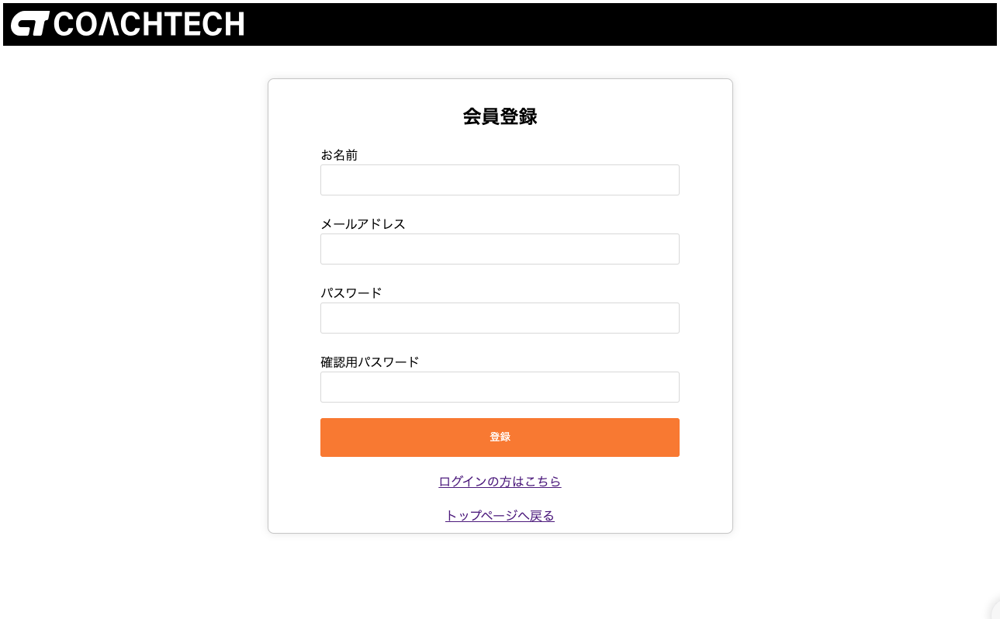
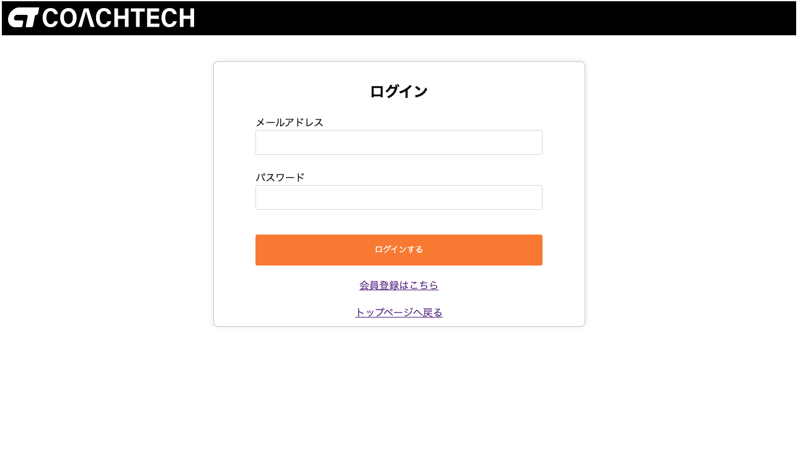
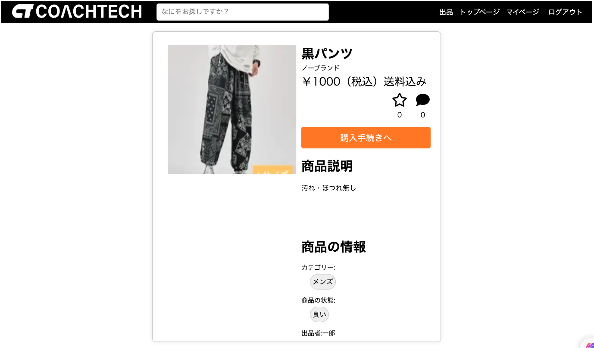
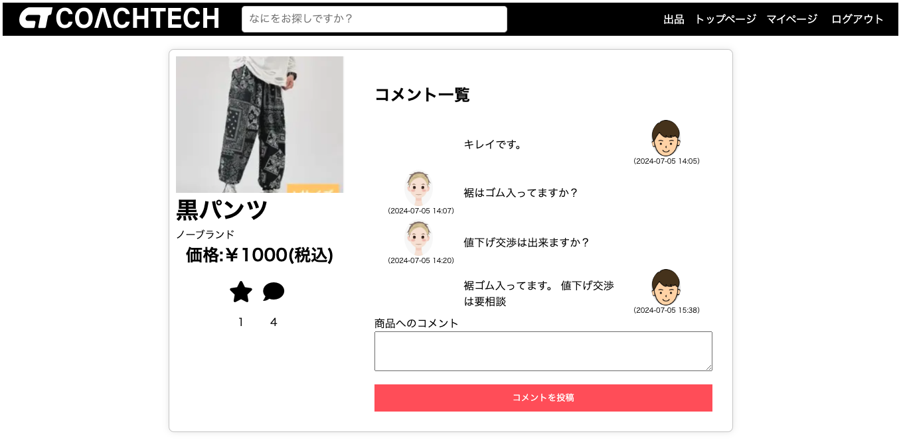
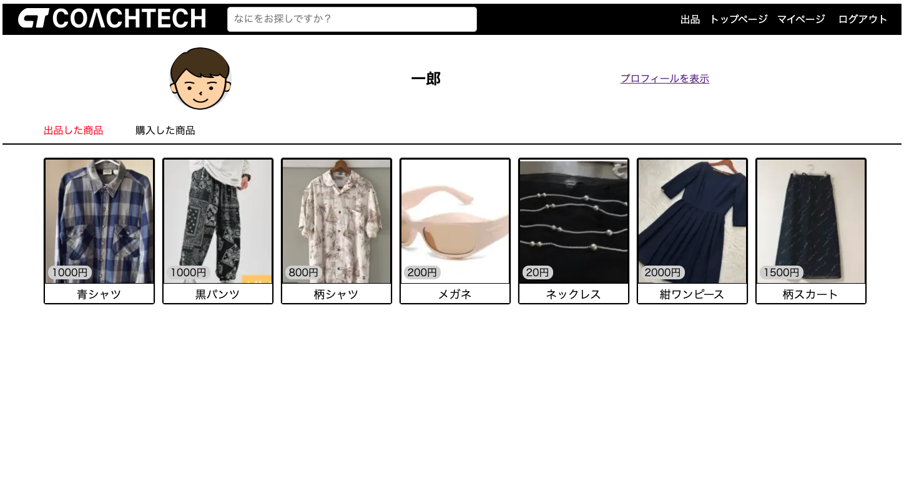
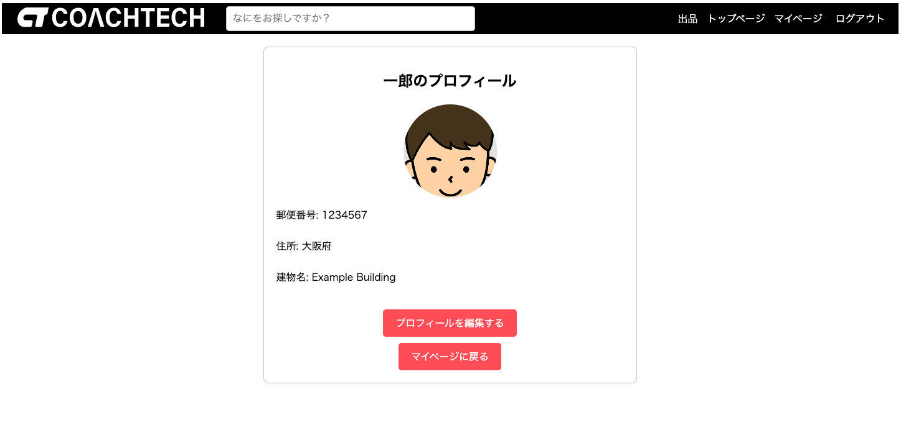
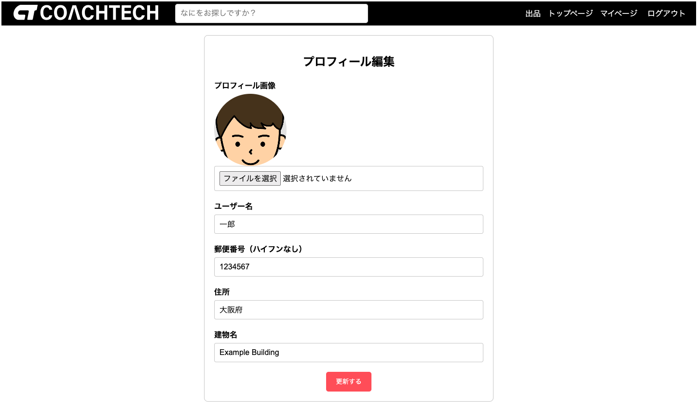
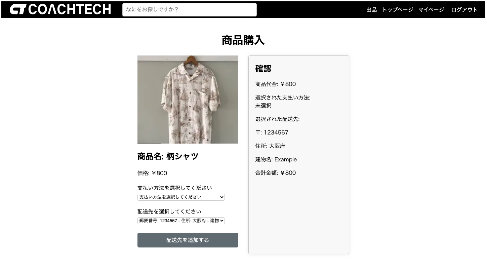
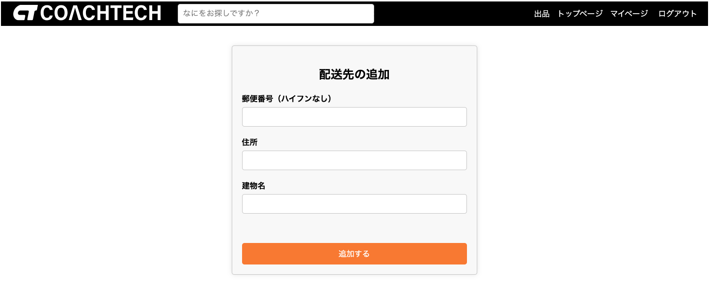
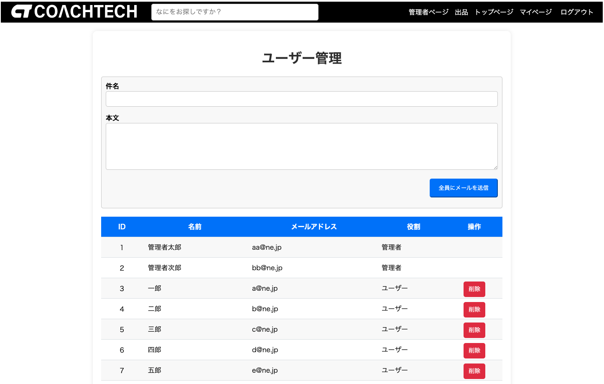

# アプリケーション名

### メルカリ風フリマアプリ

### サービス名
coachtechフリマ


## 作成目的

自社ブランドの商品を専用サイトで出品する

## 概要説明
　登録されている商品の閲覧、出品・出品品へのコメント、お気に入り登録、購入等の機能が使用者区分毎に分けて使用できるアプリケーション。<br>
　使用者の区分は3つに分けられ、1.来訪者（Visitors）、2.会員登録者（Users）、3.管理者（Admins）となり各区分で利用できる機能には制限がある。<br>
　詳細については下記「機能一覧表」参照して下さい。

機能一覧
| NO.  | 機能項目         | 役割                                    | 権限                   |
| ----- | -------------- | -------------------------------------- | --------------------- |
|   1  | 会員登録         | アカウントを登録                          | 来訪者                 |
|   2  | 商品閲覧         | 販売した全ての商品を閲覧                   | 来訪者+会員登録者+管理者  |
|   3  | 販売中商品閲覧    | 販売中の商人を閲覧                        | 来訪者+会員登録者+管理者  |
|   4  | 商品詳細閲覧      | 商品の詳細を閲覧                         | 来訪者+会員登録者+管理者 |
|   5  | 商品コメント閲覧   | 商品に対するやり取りを閲覧                  | 来訪者+会員登録者+管理者 |
|   6  | 商品検索          | 検索バーで商品検索                        | 来訪者+会員登録者+管理者 |
|   7  | ログイン          | アカウントの利用を開始                    | 会員登録者+管理者      |
|   8  | ログアウト        | アカウントの利用を終了                     | 会員登録者+管理者       |
|   9  | プロフィール作成   | アカウント詳細を作成                      | 会員登録者+管理者       |
|  10  | プロフィール表示   | アカウント詳細を表示                      | 会員登録者+管理者       |
|  11  | プロフィール編集   | アカウント詳細を編集                      | 会員登録者+管理者       |
|  12  | 商品マイリスト閲覧 | お気に入り登録した商品一覧表示             | 会員登録者+管理者       |
|  13  | 出品した商品表示   | ログイン者が出品した商品一覧表示           | 会員登録者+管理者       |
|  14  | 購入した商品表示   | ログイン者が購入した商品一覧表示           | 会員登録者+管理者       |
|  15  | 出品             | 商品を出品する                          | 会員登録者+管理者       |
|  16  | 購入             | 商品を購入する                          | 会員登録者+管理者       |
|  17  | 商品コメント作成   | 商品に対してコメントを追加                | 会員登録者+管理者       |
|  18  | 支払い方法変更     | クレジットカード、コンビニ、銀行振込から選択 | 会員登録者+管理者       |
|  19  | 配送先変更        | 任意の配送先に変更することができる          | 会員登録者+管理者       |
|  18  | お気に入り登録/削除 | 商品をマイリストに登録/削除               | 会員登録者+管理者      |
|  19  | 商品コメント削除   | コメントを削除                          | 管理者                |
|  20  | ユーザー削除       | アカウントを削除                        | 管理者                |
|  21  | メール送信        | アカウント登録者全員にメール送信           | 管理者                |
|  22  | ユーザー一覧表示   | アカウント登録者全員を閲覧                | 管理者                |

注記<br>
　NO. 5：コメントはNO.4商品詳細閲覧画面内右上側付近にある吹き出しアイコンをクリックすると表示します。他画面の吹き出しアイコンも同様に機能します。<br>
　NO. 6：商品名の一部を入力すると該当する商品のみを表示します。また、商品検索後も検索ワードは枠内で維持されたままになります。<br>
　NO.15：出品時のカテゴリーは最大3つまで選択可能です。<br>
　No.18：お気に入り登録/削除はコメント吹き出しアイコン左側にある星型アイコンをクリックすると登録されます。星型が黒塗り潰し状態が「お気に入り登録中」で解除したい場合は再度クリックすると黒塗り潰しの解除と同時に「お気に入りから削除」されます。<br>
　NO.19：配送先はデフォルトでアカウントの住所が入力されています。変更する場合は変更先住所登録後、配送先を指定し直してから購入して下さい。<br>
　　　　　※アカウント詳細を作成していない場合は未記載となります。

参考画像(サイトページ一部抜粋)
|  |  |
|:-----------------------------------------------:|:------------------------------------------:|
| 会員登録画面                                      | ログイン画面                                 |

|  |  |  |
|:---------------------------------------------------:|:----------------------------------------------:|:-------------------------------------------------------:|
| 商品詳細画面                                          | コメント画面（認証前）                            | コメント画面（認証後）                                      |

|          |  |  |
|:---------------------------------------------------:|:----------------------------------------------:|:-------------------------------------------------------:|
| マイページ画面                                        | プロフィール画面                                  | プロフィール編集画面                                        |

|               |  |  |
|:--------------------------------------------------:|:-----------------------------------------------------------------:|:-----------------------------------------:|
| 購入フォーム画面                                      | 配送先変更画面                                                      | 管理者用画                                  |

## 使用技術

- Laravel 8.83.27
- php 7.4.9
- mysql 8.0.26
- nginx 1.21.1

## テーブル設計

[テーブル設計書](https://docs.google.com/spreadsheets/d/1v1wj7750I53n69JBmRWZaRPEAu80r2nPLbNLKORSkJo/edit?gid=1188247583#gid=1188247583)

## ER図

[ER図](https://docs.google.com/spreadsheets/d/1v1wj7750I53n69JBmRWZaRPEAu80r2nPLbNLKORSkJo/edit?gid=1419563855#gid=1419563855)

## 環境構築

以下の手順に従って環境構築をして下さい。

1.GIT リポジトリをクローンして下さい。

```
git@github.com:kazuyuki-okada5/20230530okada-.git
```

2.Docker と Docker Composer をインストールして下さい。

インストール済みの場合は省略して下さい。

3.プロジェクトのルートディレクトリに移動して下さい。

4.`.env.example`ファイルをコピーして`.env`ファイルを作成して下さい。

```
cd src
cp .env.example .env
```

5.下記参照し、`.env`ファイルの環境変数を設定して下さい。

```
DB_CONNECTION=mysql
DB_HOST=mysql
DB_PORT=3306
DB_DATABASE=laravel_db
DB_USERNAME=laravel_user
DB_PASSWORD=laravel_pass
```

```
MAIL_FROM_ADDRESS=your-email@example.com
```

6.dockerを起動して下さい。

```
docker-compose up -d --build
```

7.phpコンテナに入りComposerをインストール後、暗号化キーを作成して下さい。

```
docker-compose exec php bash
composer install
php artisan key:generate
```

8.マイグレーション及びシーディング及びシンボリックリンクの設定をして下さい。

```
php artisan migrate --seed
php artisan storage:link
```

9.ローカルへのアクセス

1.〜８.までの作業が滞りなく終了したら下記リンク先からアプリケーションが開きます。<br>
[トップページ](http://localhost/) <br>
[MailHog](http://localhost:8025/)

10.ログインパスワード

ユーザー用 <br>
メールアドレス:a@ne.jp <br>
パスワード:11111111

管理者用 <br>
メールアドレス:aa@ne.jp <br>
パスワード:12345678

※管理者用のパスワードを使用するとアプリ内新規プロフィール作成以外全ての認証必須ページを閲覧することが出来ます。

11.PHPUnitを使用したテスト確認

1）テスト用のデータベースを作成します。<br>
まだdockerコンテナ内にいる場合は'exit'で出た後にターミナルで以下コマンドを実行して下さい。

```
docker-compose exec mysql mysql -u root -p
CREATE DATABASE laravel_test;
EXIT;
```

　※パスワードは`.env.testing`より確認下さい

3）`.env.testing`ファイル用のKEYを作成して下さい。

```
docker-compose exec php php artisan key:generate --env=testing
```

3）テストを実行して下さい。

```
docker-compose exec php ./vendor/bin/phpunit
```

12.AWS（本番環境）

1）下記よりアクセスして下さい。

```
http://54.168.115.123
```

2）メール（MailHog）

```
http://54.168.115.123:8025/
```


## 参考

[岡田和幸さんWeb開発生徒様用案件シート メルカリ風アプリ](https://docs.google.com/spreadsheets/d/1v1wj7750I53n69JBmRWZaRPEAu80r2nPLbNLKORSkJo/edit?gid=1113232830#gid=1113232830)
